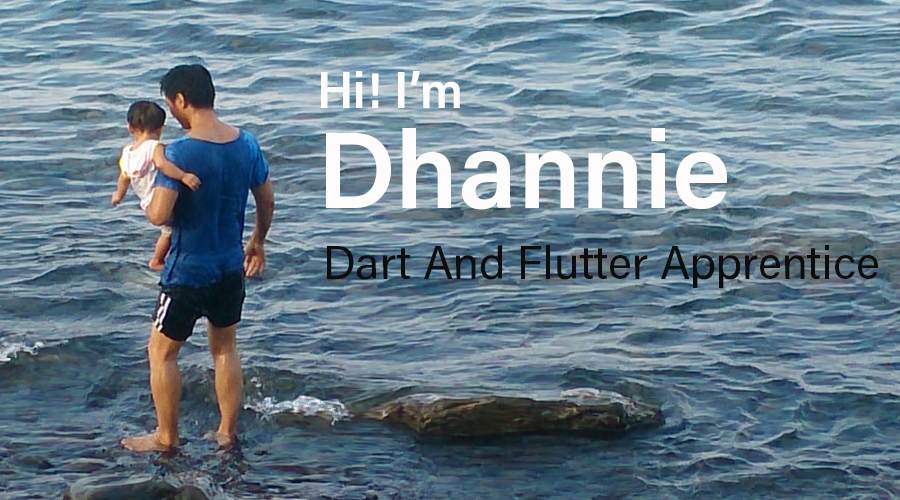

### About Me
- 🌱 Without CS background I started learning Dart and Flutter on December 2019, start with tic tac toe and created few personal app. It's not easy without someone to point out how poor is my code 😄 but I'll keep learning because flutter is fun!
- 🏁 Hopefully I can get a peek on professional app development world maybe by interning remotely.
- 📫 You can reach me by email to dhannie@live.com or my  [@dhann13](https://twitter.com/dhann13)
- 🙂 Pronounce: He/Him

### Tools & Language
       

